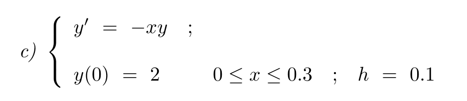

# Atividade: Como utilizar o programa

Inicialmente voce precisará ter instalado _python_, e as bibliotecas  _numpy_, _scipy_ e _matplotlib_. Caso não tenha, seguirá os seguintes passos:

1. Ir ao site do [Python](https://www.python.org) e instalar ele em seu PC.

2. Agora que você tem o Python instalado, você irá no terminal(bash ou cmd) e usar o comando `pip install numpy scipy matplotlib` para instalar as bibliotecas necessárias.

3. Você precisa baixar o repositório.

4. Quando já estiver baixado, você abre o terminal e entra na pasta pelo terminal.

5. Agora digite `python Atividade/main.py` 

### Dentro do programa

No programa você terá 3 PVI implementados.Você vai escolher um dos problemas (**A, B, C ou 0 pra sair**). O gráfico irá abrir com a plotagem do resultado numérico e Analítico utilizando a biblioteca _scipy.integrate_.

_Problema **A**:_

Gráfico Resultante do Problema A:

_Problema **B**:_

Gráfico Resultante do Problema B:

_Problema **C**:_

Gráfico Resultante do Problema C:

